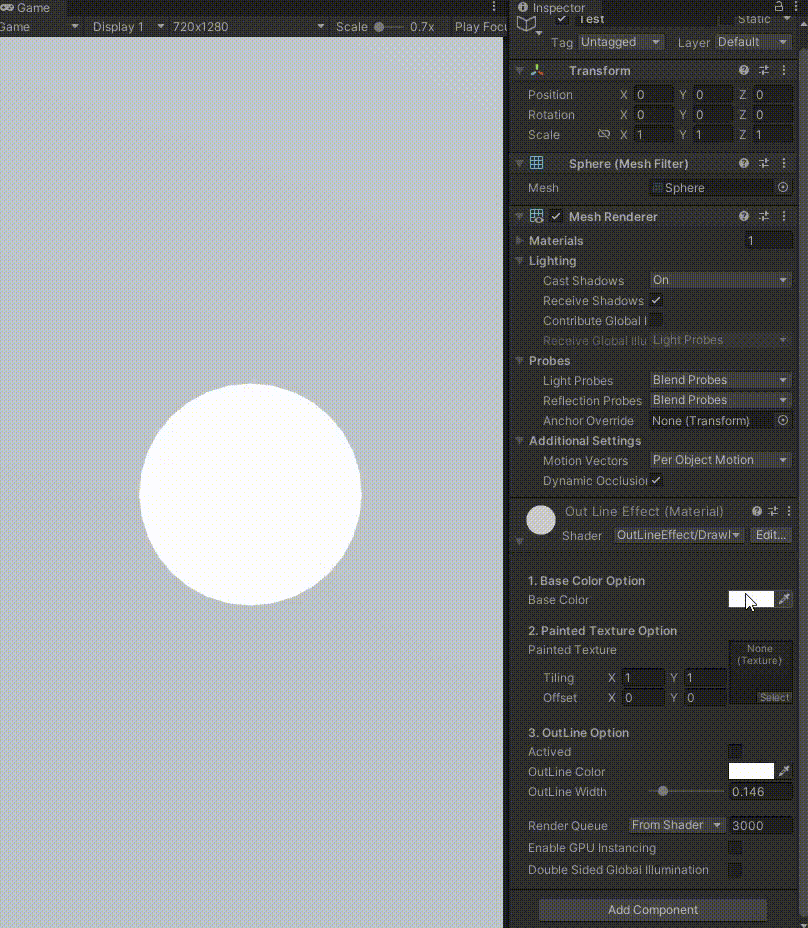
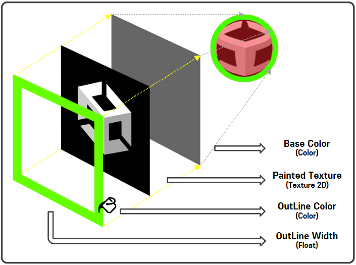

# OutLineEffect

#### ⦁ [OutLineEffect]은 물체의 외각에 아웃라인을 적용하는 Shader입니다.

#### ⦁ 2023.09.08 부, [OutLineEffect] [DrawOutLine] 적용

#### ⦁ Version 1.0 (2023.09.08)

### 1. 데모 이미지

    

### 2. 조건

- [OutLineEffect/DrawOutLine]에서 **물체의 표면을 원하는 'Brush Texture'을 이용해서 그림을 그릴 수 있어야 할 것**

- 물체의 표면 외각을 **'OutLine'을 원하는 '색상', '굵기'를 표현**할 수 있을 것

### 3. 메인 설계

    

- **'Base Color(Color)'** 를 통해서 물체를 단색으로 표현

- **'Painted Texture(Texture 2D)'와 Base Color(Color)를 블렌딩**하여 표현 (조건을 두어, **블렌딩의 여부를 결정**할 수 있도록)

- 물체의 전면 면만 그리고 **'Stencil 기법'을 이용하여 물체의 외각을 'OutLineColor(Color)', 'OutLineThickness(Float)'을 통해서 표현**

- **[OutLineEffect/DrawOutLine](https://github.com/MinjunISAAC/OutLineEffect/blob/main/OutLineEffect/Assets/Game/Shaders/DrawOutLine.shader)**
